# 🚀 Code Studio

> Online code editor and IDE built with Next.js & Node.js. Write, edit, and preview your code in real-time with Monaco Editor.

**Live**: [studio.iamabhinav.dev](https://studio.iamabhinav.dev) | **API**: [studio.koyeb.app](https://studio.koyeb.app) | **API Docs**: [API_DOCS.md](./server/API_DOCS.md)

## ✨ Key Features

- 🛡️ **Rate Limiting** - Protection against abuse
- ⚠️ **Error Handling** - Centralized error handling middleware
- 🌐 **HTTP Request Logging** - Morgan access logs (`logs/app.log`)
- 🖥️ **Server Logging** - Winston logs (`logs/server.log`, `logs/error.log`)
- 🎨 **Monaco Editor** - VS Code-like code editor with syntax highlighting
- 📁 **File Tree Explorer** - Manage files and folders with ease
- 👁️ **Live Preview** - See your changes in real-time
- 🌙 **Theme Switcher** - Dark/Light mode support
- � **Auto-save** - Automatic project saving
- 📥 **Download** - Export projects as ZIP files
- ⚡ **Fast** - Next.js 15 + React 19 + Turbopack

## 🛠️ Tech Stack

**Frontend:** Next.js 15, React 19, Tailwind CSS 4, Monaco Editor, Zustand, Axios  
**Backend:** Node.js, Express 5, MongoDB, JWT, Winston, Zod, Morgan  
**Tools:** Biome, pnpm


## 🏗️ Architecture

```mermaid
graph TB
    User([👤 User]) -->|Browser| Frontend[🎨 Next.js Frontend]
    
    Frontend -->|API Calls| Auth[🔐 Auth API]
    Frontend -->|API Calls| Project[📦 Project API]
    
    Auth -->|JWT Tokens| Middleware{🛡️ Auth Middleware}
    Project -->|JWT Tokens| Middleware
    
    Middleware -->|Verify| JWT[🔑 JWT Service]
    Middleware -->|Validated| Controllers[⚙️ Controllers]
    
    Controllers -->|CRUD| MongoDB[(🗄️ MongoDB)]
    
    Frontend -.->|Live Preview| Monaco[📝 Monaco Editor]
    Frontend -.->|State| Zustand[💾 Zustand Store]
    
    subgraph "Frontend "
        Frontend
        Monaco
        Zustand
    end
    
    subgraph "Backend in Express JS"
        Auth
        Project
        Middleware
        JWT
        Controllers
    end
    
    subgraph "Database"
        MongoDB
    end
    
    style Frontend fill:#61dafb,stroke:#333,color:#000
    style MongoDB fill:#4db33d,stroke:#333,color:#fff
    style Auth fill:#f39c12,stroke:#333,color:#000
    style Project fill:#f39c12,stroke:#333,color:#000
```




## 🚀 Quick Start

**Prerequisites:** Node.js 18+, pnpm, MongoDB

```bash
# Clone & Install
git clone https://github.com/rishiyaduwanshi/codestudio.git
cd codestudio
pnpm install

# Frontend (Port 3000)
pnpm dev

# Backend (Port 5000)
cd server
pnpm install
pnpm dev
```

## 📚 API Endpoints

**Base URL:** `https://studio.koyeb.app` | Local: `http://localhost:5000`

### Auth
- `POST /api/v1/auth/signup` - Register
- `POST /api/v1/auth/signin` - Login  
- `POST /api/v1/auth/refresh-token` - Refresh token
- `POST /api/v1/auth/signout` - Logout

### Projects (Protected)
- `GET /api/v1/projects` - Get all projects
- `GET /api/v1/projects/:id` - Get project by ID
- `POST /api/v1/projects` - Create project
- `PUT /api/v1/projects/:id` - Update project
- `DELETE /api/v1/projects/:id` - Delete project

📖 **Full docs:** [API_DOCS.md](./server/API_DOCS.md)

## 🔐 Environment Variables

**Frontend** (`.env.local`)
```env
NEXT_PUBLIC_API_URL=https://studio.koyeb.app
```

**Backend** (`.env`)
```env
PORT=5000
NODE_ENV=production
MONGODB_URI=your_mongodb_uri
JWT_SECRET=your_jwt_secret
JWT_EXPIRES_IN=15m
REFRESH_TOKEN_SECRET=your_refresh_secret
REFRESH_TOKEN_EXPIRES_IN=7d
ALLOWED_ORIGINS=https://studio.iamabhinav.dev
```

---

**Made with ❤️ by [Abhinav](https://iamabhinav.dev)**

- **Blog**: [blog.iamabhinav.dev](https://blog.iamabhinav.dev)
- **Mail**: [hello@iamabhinav.dev](mailto:hello@iamabhinav.dev)
- **GitHub**: [@rishiyaduwanshi](https://github.com/rishiyaduwanshi)

- 🌐 **Frontend**: [studio.iamabhinav.dev](https://studio.iamabhinav.dev)
- 🔧 **Backend**: [studio.koyeb.app](https://studio.koyeb.app)
- 📖 **API Documentation**: [API_DOCS.md](./server/API_DOCS.md)
